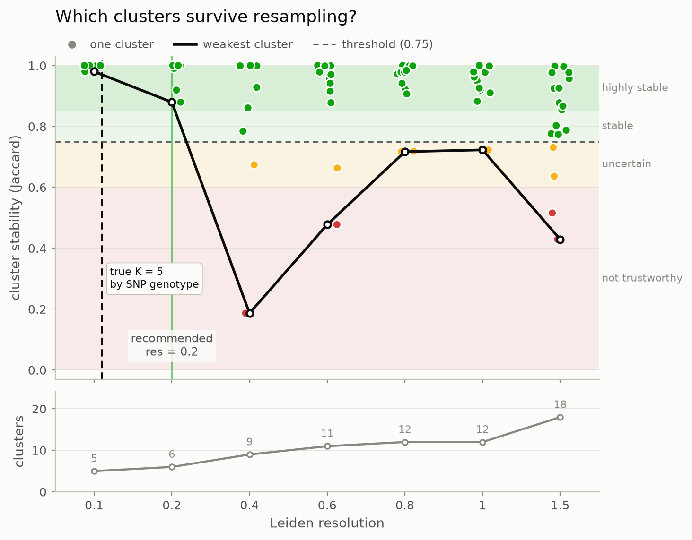

# scstability

**Which of your single-cell clusters survive resampling, and which dissolve?**

[](https://github.com/ateferos77/scstability/actions/workflows/test.yml)
[](LICENSE)
[](https://www.python.org/downloads/)

Leiden will return clusters from pure noise, confidently. The silhouette score
will not save you: it rewards compactness, which a slice carved out of a
continuum also has. `scstability` answers the question that actually matters:
**would this cluster still be here if you had sequenced a different sample of
the same cells?**

It implements the cluster-wise Jaccard stability of **Hennig (2007)** over
subsampled reclusterings. AnnData-first, scanpy-compatible, one function call.



<sub>Five human cell lines mixed and sequenced together, each cell assigned to
its line by SNP genotype (Tian et al., *Nature Methods* 2019). The package sees
only PCA coordinates, never the genotype, and finds the true five groups
stable at 0.980, with everything finer collapsing. See
[Does it work?](#does-it-work)</sub>

---

## Contents

- [What it does](#what-it-does) · [Installation](#installation) · [Quick start](#quick-start)
- [Reading the score](#reading-the-score): **read this before trusting a number**
- [Does it work?](#does-it-work) · [Performance](#performance)
- [API](#api), and the [full reference](docs/API.md)
- [Prior art](#prior-art) · [Limitations](#limitations) · [Citing](#citing)

Two executed notebooks carry the detail:
**[usage walkthrough](examples/pbmc_walkthrough.ipynb)** on 11,000 real PBMCs,
and **[the validation](benchmarks/validation.ipynb)**.

---

## What it does

1. **Cluster the full data** at each resolution. This is the reference.
2. **Draw 80% of the cells** without replacement, rebuild the kNN graph on just
   those cells, and recluster from scratch.
3. **Match each reference cluster** to the resampled cluster it overlaps most,
   and record the **Jaccard index** of that best match.
4. **Repeat**, then take the mean per cluster. That is its stability.
5. **Report the weakest cluster** per resolution, because a clustering is only
   as trustworthy as its least reproducible part.

Cells are sampled **without** replacement on purpose: duplicates sit at
distance zero and corrupt a kNN graph. The embedding is held fixed, so what is
measured is the instability of graph construction and community detection, not
of PCA.

---

## Installation

```bash
pip install scstability
```

Requires Python 3.12+ and scanpy 1.10+.

```bash
git clone https://github.com/ateferos77/scstability
cd scstability
pip install -e ".[dev]"
```

---

## Quick start

```python
import scanpy as sc
import scstability as scs

adata = sc.read_h5ad("my_data.h5ad")  # needs adata.obsm["X_pca"]

result = scs.stability_sweep(adata, resolutions=[0.2, 0.4, 0.8, 1.2, 1.6])

print(result.summary())  # one row per resolution
print(result.recommend())  # the resolution to use
result.to_adata(adata)  # scores into adata.obs
scs.pl.stability_curve(result)  # the figure above
```

```
 resolution  n_clusters  min_cluster_stability  median_cluster_stability
        0.1           5                  0.980                     1.000
        0.2           6                  0.880                     0.995
        0.4           9                  0.187                     0.928
```

That is the whole interface. Every argument is documented in the
**[API reference](docs/API.md)**.

---

## Reading the score

Each score is a Jaccard index in `[0, 1]`. The bands are Hennig's, as
`fpc::clusterboot` states them.

| mean Jaccard | band | what to do |
|---|---|---|
| **≥ 0.85** | highly stable | Report it. A real, reproducible group |
| **0.75 - 0.85** | stable | Report it. Sound enough to build on |
| **0.60 - 0.75** | uncertain | A pattern is there, but do not build a claim on this cluster alone |
| **< 0.60** | not trustworthy | Treat as dissolved |

Two things that will mislead you if you skip them:

**Read `min_cluster_stability`, not the median.** A resolution is only as
trustworthy as its weakest cluster. Real data routinely shows a median of 0.94
beside a minimum of 0.18. The median hides exactly the cluster you needed.

**Read `n_clusters` alongside the score.** A partition with one cluster scores
near 1.0 on structureless data, because the resample collapses the same way.
`recommend()` guards against this; your own reading of `summary()` must too.

The bands apply to `jaccard_mean`. Bootstrap Jaccards are left-skewed, so the
median runs optimistically; `jaccard_median` and the quartiles are reported
alongside as distribution *shape*.

---

## Does it work?

**[benchmarks/validation.ipynb](benchmarks/validation.ipynb)** is the evidence,
executed, with every figure and table rendered, so it can be read without
running anything.

Most single-cell "ground truth" is circular: the cell-type labels were produced
by clustering the same matrix. `sc_10x_5cl` escapes that: five cell lines,
each cell assigned by **SNP genotype**.

| check | result |
|---|---|
| recovers the true K = 5 | **0.980**, collapsing to 0.187 two resolutions later |
| correlation with genotype identity | **Spearman +0.575**, p = 1e-07, 73 clusters |
| versus a matched unimodal null | **0.980** real vs **0.322** null at K = 5 |
| tracks *set recovery*, not local purity | purity is 1.0 for **all** 73 clusters and cannot discriminate at all; stability separates them |
| adds information over seed stability | seed adds **+0.000** R² once sampling is known; sampling adds **+0.056** over seed |

Also: 125 tests plus 2 slow real-data tests, 98% coverage, a set-based oracle
over 700 random configurations, mutation testing, and public-API tests that run
in a clean subprocess.

---

## Performance

5 resolutions × 20 bootstraps = 100 reclusterings, on subsamples of a real 68k
PBMC dataset:

| cells | wall clock | peak RAM |
|---|---|---|
| 2,000 | 12 s | 0.4 GB |
| 10,000 | 60 s | 0.7 GB |
| 20,000 | 3.5 min | 1.7 GB |
| **68,000** | **10 min** | **2.1 GB** |

Mildly super-linear (1.46× relative to linear). Memory is dominated by the
graph, not by anything this package allocates.

---

## API

```python
scs.stability_sweep(adata, resolutions, *, n_boot=20, frac=0.8,
                    use_rep="X_pca", n_neighbors=15, random_state=0,
                    progress=True) -> StabilityResult

result.summary(stable_threshold=0.75)   # DataFrame, one row per resolution
result.recommend(threshold=0.75)        # float, a resolution from the grid
result.to_adata(adata, key_added="stability")

scs.pl.stability_curve(result, threshold=0.75, ax=None)
scs.pl.cluster_stability(result, resolution, ax=None)
scs.pl.stability_umap(adata, result, resolution, ax=None)

scs.HENNIG_BANDS                        # the interpretation table, as data
```

**[Full API reference](docs/API.md)**: every parameter, return value, error
and warning, with recipes.

---

## Prior art

Two different things get called cluster stability, and keeping them apart is
the whole point:

- **Seed stability.** Rerun the same clustering on the same graph with a
  different seed. Measures whether community detection lands in a consistent
  local optimum. Cheap.
- **Sampling stability.** Recluster a *resample of the cells*. Measures
  whether the cluster would survive sequencing a different subset. Expensive.
  **This is what `scstability` measures.**

In R this is solved: `fpc::clusterboot` (Hennig 2007), `chooseR`,
`bluster::bootstrapStability`, `scclusteval`, `ClustAssess`.

In Python the landscape is **not empty**, and every existing tool measures
something else:

| Tool | Measures |
|---|---|
| `ClustAssessPy` | Element-centric consistency **across seeds** on a fixed graph |
| `scICE` (Julia) | Inconsistency coefficient **across seeds** |
| `pyclustree` | Draws the tree of assignments across resolutions; no resampling, no score |
| `constclust` | Meta-clustering over a parameter grid; appears unmaintained |
| `reval`, `skstab` | Generic stability validation, not single-cell, not AnnData-aware |
| `scanpy` | No stability functionality ([scverse/scanpy#3533](https://github.com/scverse/scanpy/issues/3533)) |

> Python has clustering-stability tooling, and all of it measures stability
> across random seeds. The subsampling-based, cluster-wise Jaccard approach has
> no maintained, installable, AnnData-first Python implementation.

### "scICE showed reseeding is 30× cheaper and gets the same signal"

A fair objection from a strong paper, so we measured it against `ClustAssessPy`
with identical clustering in both arms
([notebook](benchmarks/validation.ipynb), section 4).

**The objection is largely right.** At cluster level the two agree closely
(Spearman +0.907), and zero of 73 clusters were seed-stable yet
sampling-unstable. If you want a ranking on well-separated data, **use
`ClustAssessPy`, which is cheaper and will usually agree.**

The difference is asymmetric rather than large. Element-centric consistency
**saturates**: 45% of clusters sit at ECS ≥ 0.99, where it can no longer tell a
real cluster from an arbitrary one, while their true quality still ranges 0.13
to 1.00. Measured threshold-free, seed stability adds **+0.000** R² to
predicting ground truth once sampling stability is known; sampling adds
**+0.056** over seed. If you need to know whether one specific
confident-looking cluster is real, reseeding cannot tell you, because it never
removes a cell.

---

## Limitations

1. **It does not find the true number of clusters.** A reproducible over-split
   of a stable cluster is still reproducible. On the genotype-labelled data it
   returns 6 where the truth is 5.
2. **It does not replace biological validation.** A stable cluster can still be
   a doublet artefact or an uncorrected batch. Stability is necessary, not
   sufficient.
3. **It holds the embedding fixed.** Instability of PCA or integration is a
   larger and slower question.
4. **It does not invent a metric.** The measure is Hennig (2007).
5. **It measures sampling stability, not seed stability.** For the latter, use
   `ClustAssessPy` or `scICE`.
6. **A single cluster scores ~1.0** on structureless data. Always read
   `n_clusters`.
7. **Very small clusters are noisy.** Check `jaccard_q25`/`jaccard_q75`.
8. **Per-cell scores saturate** on well-separated data.
9. **Benchmarked against `ClustAssessPy` only.** `scICE` and `chooseR` have not
   been run, and no number for either appears in this repository. Correctness
   is validated on 3,822 and 2,531 cells; scale is measured separately to
   68,000. Those are different claims on different data.

---

## Citing

Please cite the **method**, which is not ours:

> Hennig, C. (2007). Cluster-wise assessment of cluster stability.
> *Computational Statistics & Data Analysis*, 52(1), 258-271.

<details>
<summary>Related work, depending on what you claim</summary>

> Patterson-Cross, R.B., Levine, A.J. & Menon, V. (2021). Selecting single cell
> clustering parameter values using subsampling-based robustness metrics.
> *BMC Bioinformatics*, 22, 39.

> Tang, M. et al. (2021). Evaluating single-cell cluster stability using the
> Jaccard similarity index. *Bioinformatics*, 37(15), 2212-2214.

> Tian, L. et al. (2019). Benchmarking single cell RNA-sequencing analysis
> pipelines using mixture control experiments. *Nature Methods*, 16, 479-487.
> *(the validation data)*

> Baek, S. et al. (2025). scICE: enhancing clustering reliability and
> efficiency of scRNA-seq data with multi-resolution consensus clustering.
> *Nature Communications*. *(seed stability)*

> Tibshirani, R., Walther, G. & Hastie, T. (2001). Estimating the number of
> clusters in a data set via the gap statistic. *JRSS-B*, 63(2), 411-423.
> *(the matched null)*

> Liu, Y. et al. (2008). Statistical significance of clustering for
> high-dimension, low-sample-size data. *JASA*, 103(483), 1281-1293.

> von Luxburg, U. (2010). Clustering stability: an overview. *Foundations and
> Trends in Machine Learning*, 2(3), 235-274. *(why stability alone cannot
> choose K)*

</details>

---

## Development

```bash
micromamba env create -f environment.yml && micromamba activate scstability
pip install -e ".[dev]"
pre-commit install

pytest                                    # fast suite
pytest -m slow                            # real-data tests
pytest --doctest-modules src/scstability  # docstring examples
ruff check . && ruff format --check .
```

The test suite is the specification: if you change behaviour, a test changes
with it.

## License

BSD 3-Clause. See [LICENSE](LICENSE).
